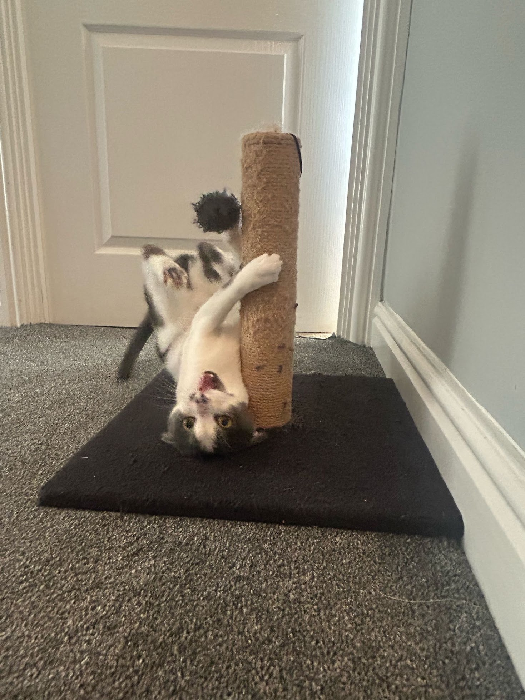
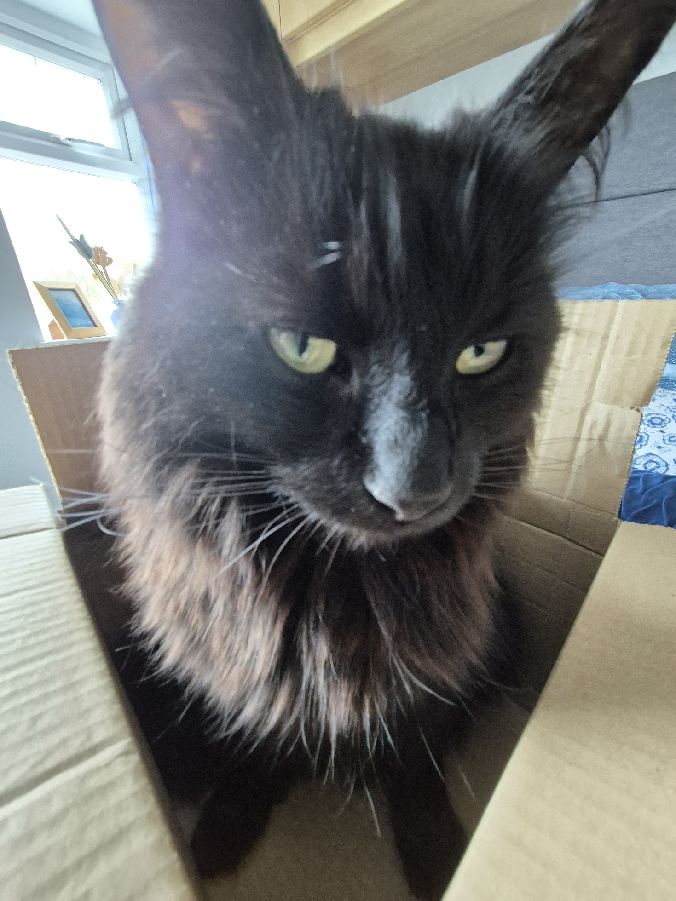
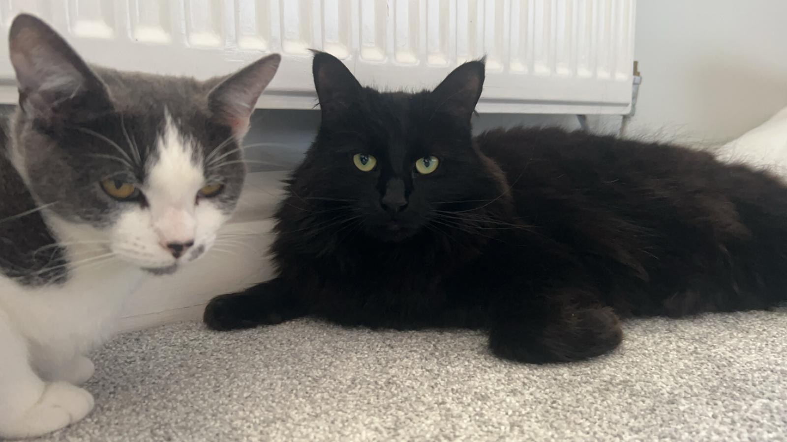

# Toby Clark 

Software Engineer with a focus on backend systems, concurrency, and distributed architectures. First-Class Honours Computer Science graduate from Lancaster University, awarded the **SCC Departmental Prize for Best Final Year Project (A+)**.

---

### Featured Projects

| Project | Description | Stack |
| :--- | :--- | :--- |
| **[Lecture Max](https://github.com/AdClarky/lecture-max)** | **Distributed Presentation Display Engine** Centralised server syncing distributed presentation instances across a 16-screen (15360×2160) video wall in real-time. Features multi-client remote controls, decoupled presentations, and containerised deployments.  *Won SCC Departmental Prize for Best Final Year Project*  | `TypeScript` `Node.js` `Socket.io` `Docker` `React` |
| **[Chessboard](https://github.com/AdClarky/chessboard)** | **Bitboard Chess Engine & GUI** Standard chess engine implementation featuring 64-bit bitboards for efficient board representation, legal move generation, and state evaluation, with a Java Swing interface. | `Java` `Swing` `Algorithms` |

---

### Technical Competencies

- **Languages:** Java, Go, TypeScript, C, Python, SQL
- **Systems & Architecture:** Distributed Systems, Concurrency & Parallelism, WebSockets, RESTful Services
- **Data & Storage:** PostgreSQL, SQLite
- **Infrastructure & DevOps:** Linux, Docker, Caddy, Reverse Proxies, Git, Bash

---

### Homelab Management

Alongside software development, I enjoy self-hosting infrastructure on a personal Linux server to gain hands-on experience with production networking, security, and storage architecture.
- **Security:** Centralised authentication via Authentik (OIDC/SSO), automated network protection using CrowdSec.
- **Networking:** Local DNS resolution, isolated VLANs, secure remote access via Tailscale, and reverse proxies (Caddy, Nginx).
- **Data Management:** Database management (PostgreSQL, SQLite) with automated, deduplicated backups via Kopia to Backblaze B2.
- **System:** Multi-user media server alongside system monitoring.

---
### Meet the Team
   

  | Member | Role | Primary Responsibilities |
  | :--- | :---: | :--- |
  | **Smudge** Inexperienced Dev |  | • Breaking everything • Eating all the food • Bad work posture (constantly upside down) |
  | **Poppy** Team Leader |  | • Enforcing strict no talking workplace • Investigating missing food • Leads posture reviews |

   

  

    <b>Team Photo</b> 
     
  

